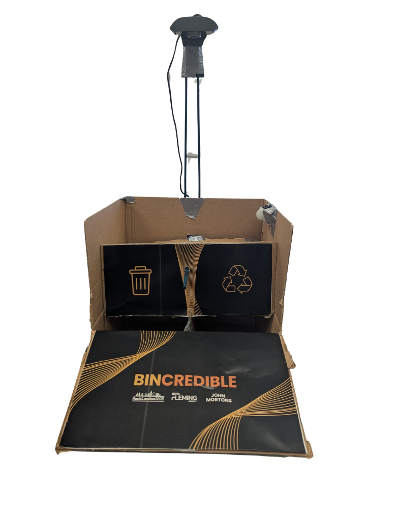

# HackLondon25: BINCREDIBLE (Smart Waste Classification System)

An advanced computer vision project developed for HackLondon25 that leverages machine learning and hardware integration for waste classification. The project uses a Flask web server with OpenCV for real-time video streaming, motion detection, and image classification of recyclable vs. non-recyclable items. It also integrates with Arduino/ESP32 to control a servo motor based on classification results.



---

## Table of Contents

- [Overview](#overview)
- [Features](#features)
- [Architecture](#architecture)
- [Installation & Setup](#installation--setup)
- [Usage](#usage)
- [Hardware Integration](#hardware-integration)
  - [With PIR Sensor](#with-pir-sensor)
  - [Without PIR Sensor](#without-pir-sensor)
- [Screenshots](#screenshots)
- [Contributing](#contributing)
- [License](#license)

---

## Overview

BINCREDIBLE is a real-time waste classification system that uses:
- **Computer Vision & Machine Learning**: Utilizes OpenCV for capturing and processing video frames, and an SGD classifier for classifying images as "Recyclable" or "Non-Recyclable". Features are extracted using a combination of HOG, color histograms, and basic image statistics.
- **Web Interface**: Built with Flask, it provides a user-friendly interface to view the live video stream, train the model, and classify items manually or automatically.
- **Hardware Integration**: Communicates with Arduino/ESP32-based servo systems to physically sort items based on the classification outcome.

---

## Features

- **Real-Time Video Streaming**: Displays live camera feed with overlaid training and classification information.
- **Motion Detection**: Uses background subtraction and contour analysis to trigger automatic classification.
- **Model Training & Feedback**: Captures images, extracts features, and trains an SGD classifier. Users can also provide feedback for incorrect classifications.
- **Automatic & Manual Modes**: Toggle between automatic mode (motion-based) and manual mode (button-triggered classification/training).
- **Serial Communication**: Sends commands to an Arduino/ESP32 board to control servo motors for sorting based on classification results.
- **Easy Reset & Advanced Controls**: Options to reset the model and view current training data.

---

## Architecture

The project consists of the following components:

1. **Python/Flask Backend**  
   - `main.py`: Contains the core application logic, including image capture, feature extraction, model training, and classification.
   - Uses OpenCV for image processing and scikit-learn for the machine learning pipeline.

2. **Frontend Web Interface**  
   - `/templates/index.html`: HTML, CSS, and JavaScript for the user interface. Provides live video feed, control buttons, and visual feedback.
  
3. **Arduino/ESP32 Code**  
   - `withPIR.c`: Arduino code integrating a PIR sensor for motion detection and servo control.
   - `Without PIR`: Alternative Arduino code for servo control without using a PIR sensor.

---

## Installation & Setup

### Prerequisites

- **Python 3.7+**
- **Pip** package manager
- **Arduino IDE** (for uploading firmware to the Arduino/ESP32)
- **Hardware**: Webcam, Arduino/ESP32 board, servo motor, (optional) PIR sensor.

### Python Dependencies

Install required Python packages:
```bash
pip install opencv-python numpy flask scikit-learn joblib
```


### Folder Structure
```bash
HackLondon25/
├── dataset/
│   ├── recyclable/
│   ├── non_recyclable/
│   └── temp/
├── main.py
├── templates/
│   └── index.html
├── withPIR.c
└── withoutPIR.c
```

### Usage
Run the Flask Server
1. Start the server with:

```bash
python main.py
```

2. The app will be available at http://0.0.0.0:5000.

3. Access the Web Interface
Open your web browser and navigate to the URL above to view the live video feed and control the system.

4. Training & Classification

Manual Mode: Use the buttons on the UI to train on "Recyclable" or "Non-Recyclable" items, and trigger classification.
Automatic Mode: Enable auto mode to allow motion detection to capture frames and classify items automatically.
Feedback: Provide feedback if the classification is incorrect to improve the model.

5. Hardware Control
The system sends commands via the serial port (COM4 by default) to the Arduino/ESP32. Adjust the COM port in main.py if needed.

### Hardware Integration

## With PIR Sensor
Code File: withPIR.c

Description: This code uses a PIR sensor to detect motion and control a servo motor based on serial commands ("recyclable" or "non_recyclable").

Connections:
Servo connected to GPIO 15.
PIR sensor connected to GPIO 14.

Behaviour: The servo moves to specific angles based on the classification result received from the Python backend.


## Without PIR Sensor
Code File: withoutPIR.c

Description: Alternative code that controls a servo motor without using a PIR sensor.

Connections:
Servo connected to GPIO 13.

Behaviuor: The servo smoothly moves left or right based on the received command and returns to its origin position.

### Screenshots

### Contributing
Contributions are welcome! If you want to help improve BINCREDIBLE:

Fork the repository.
Create a new branch for your feature or bugfix.
Submit a pull request with a clear description of your changes.

### License
This project is licensed under the MIT License. 

